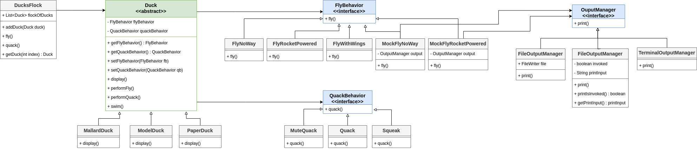
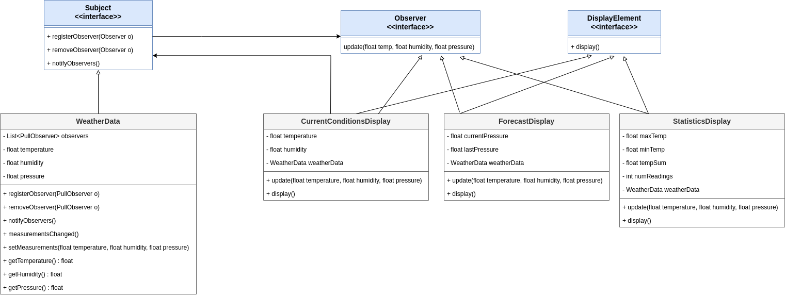
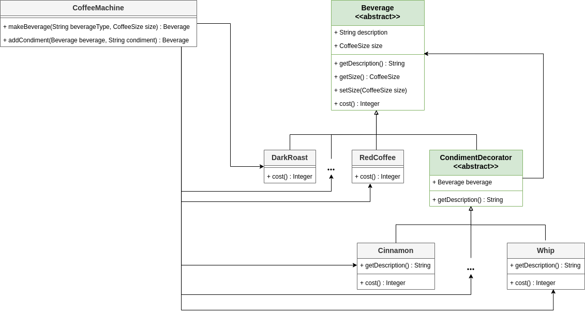
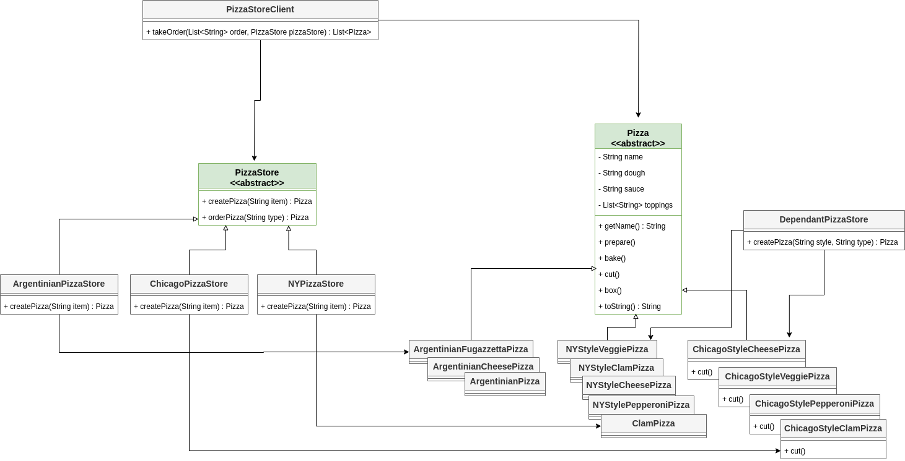
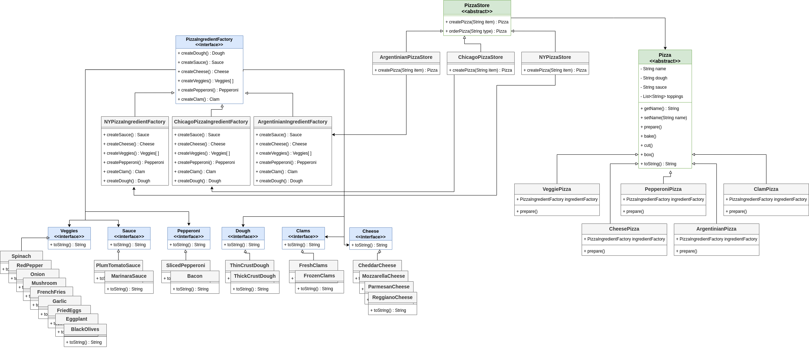
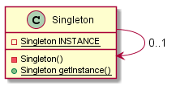
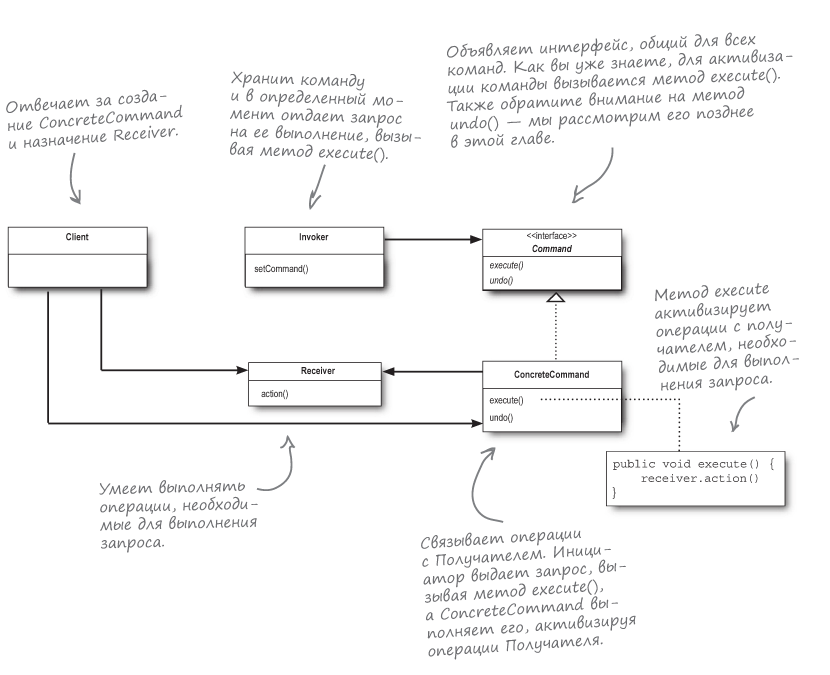

## 🎁 Head First. Паттерны проектирования


В этом репозитории представлен программный код 
шаблонов проектирования **"Head First Design Patters"** (2-е издание книги, выпущенное в декабре 2020 года).

> **Примечание**: Каждый из паттернов
> включает UML-диаграмму, чтобы упростить процесс 
> визуализации. Диаграмма находится 
> в пакете `diagram`.

### 📃 Содержание
1. [Паттерны проектирования](#-паттерны-проектирования)
2. [Классификация паттернов](#-классификация-паттернов)
3. [Как запустить исходный код?](#-как-запустить-программный-код)
4. [Модульные тесты](#-модульные-тесты)
___

### 🤖 Классификация паттернов
**_Порождающие (Creational Patterns):_**
1) Одиночка (Singleton).
2) Абстрактная Фабрика (Abstract Factory).
3) Фабричный Метод (Factory Method).

**_Поведенческие (Behavioral Patterns):_**
1) Стратегия (Strategy).
2) Наблюдатель (Observer).
3) Команда (Command).

**_Структурные (Structural Patterns):_**
1) Декоратор (Decorator).
2) 

---

### 💰 Паттерны проектирования

| №  |          Название паттерна           |                                                                                                                                                                                       Описание                                                                                                                                                                                       |                                    Заметки                                    |                           Исходный код                           |                                                                       UML-диаграмма                                                                        |
|----|:------------------------------------:|:------------------------------------------------------------------------------------------------------------------------------------------------------------------------------------------------------------------------------------------------------------------------------------------------------------------------------------------------------------------------------------:|:-----------------------------------------------------------------------------:|:----------------------------------------------------------------:|:----------------------------------------------------------------------------------------------------------------------------------------------------------:|
| 1  |              Стратегия               |                                                                                                                                          Определяет семейство алгоритмов, инкапсулирует каждый из них и обеспечивает их взаимозаменяемость.                                                                                                                                          |       [Заметки к паттерну "Стратегия"](src/main/java/ducks/Chapter1.md)       |               [DuckSimulator](src/main/java/ducks)               |                                                                                          |
| 2  |             Наблюдатель              |                                                                                            Определяет отношение **"один ко многим"** между объектами таким образом, что при изменении состояния одного объекта происходит автоматическое оповещение и обновление всех зависимых объектов.                                                                                            | [Заметки к паттерну "Наблюдатель"](src/main/java/weatherstation/Chapter2.md)  |          [WeatherStation](src/main/java/weatherstation)          |                                                                                 |
| 3  |              Декоратор               |                                                                                                                         Динамически наделяет объект новыми возможностями и является гибкой альтернативой субклассированию в области расширения функционала.                                                                                                                          |     [Заметки к паттерну "Декоратор"](src/main/java/starbuzz/Chapter3.md)      |                [Starbuzz](src/main/java/starbuzz)                |                                                                                         |
| 4  | Фабричный метод, Абстрактная Фабрика | **Паттерн Фабричный Метод** определяет интерфейс создания объекта, но позволяет субклассам выбрать класс создаваемого экземпляра. Таким образом, Фабричный Метод делегирует операцию создания экземпляра субклассам.<br/> **Паттерн Абстрактная Фабрика** предоставляет интерфейс создания семейств взаимосвязанных или взаимозависимых объектов без указания их конкретных классов. | [Заметки к паттерну "Абстрактная Фабрика"](src/main/java/factory/Chapter4.md) |               [PizzaStore](src/main/java/factory)                | <br/>  |
| 5  |               Одиночка               |                                                                                                                       **_Паттерн Одиночка_** гарантирует, что класс имеет только один экземпляр, и предоставляет глобальную точку доступа к этому экземпляру.                                                                                                                        |     [Заметки к паттерну "Одиночка"](src/main/java/singleton/Chapter5.md)      |  [Chocolate Boiler](src/main/java/singleton/chocolateWithEnum)   |                                                                                           |
| 6  |               Команда                |                                                                                             Инкапсулирует запрос в виде объекта, делая возможной параметризацию клиентских объектов с другими запросами, организацию очереди и регистрацию запросов, а также поддержку отмены операций.                                                                                              |       [Заметки к паттерну "Команда"](src/main/java/command/Chapter6.md)       | [Remote Control](src/main/java/command/party/RemoteLoader.java)  |                                                                                           |
___

### 🚀 Как запустить программный код?
Для запуска Вы можете использовать либо утилиту `make`, либо же `Gradle Wrapper`.

Список make-команд, которые доступны для работы:
```bash
make help

# Available Commands:
#  make build          - Build project
#  make run-X          - Launch project (example, make run-Ducks)
#  make test           - Run the tests
#  make lint           - Check the code style
```

Для того чтобы запустить программный код, расположенный, допустим, в пакете `ducks`,
нужно выполнить следующую команду:
```bash
make run-Ducks
```

Если использовать Gradle Wrapper, то нужно воспользоваться
следующей командой:
```bash
./gradlew runDucks
```
Для вывода содержимого в текстовый файл, можно использовать
следующую команду:
```bash
./gradlew runDucks > example.txt
```

### ▶️ Модульные тесты
Для запуска тестов вы можете использовать следующую команду:
```bash
make test
```
