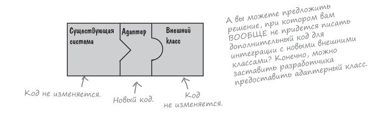

## 🔋 Паттерны Адаптер и Фасад
В этой главе будем имитировать интерфейс, которым
они в действительности не обладают. Для чего?  
Чтобы адаптировать архитектуру, рассчитанную на один
интерфейс, для класса, реализующего другой интерфейс.

### Содержание
1. [Адаптеры вокруг нас](#-адаптеры-вокруг-нас)
2. [Объектно-ориентированные адаптеры](#-объектно-ориентированные-адаптеры)

### 🔌 Адаптеры вокруг нас
Адаптер включается между вилкой ноутбука и розеткой
европейского стандарта, он адаптирует европейскую розетку,
чтобы вы могли подключить к ней свое устройство и пользоваться им.
Или можно сказать иначе: адаптер приводит интерфейс розетки
к интерфейсу, на который рассчитан ваш ноутбук.

> Адаптеры преобразуют интерфейс к тому виду,
> на который рассчитан клиент.

### 📲 Объектно-ориентированные адаптеры
Адаптер играет роль посредника: он получает запросы от
клиента и преобразует их в запросы, понятные внешним классам.

