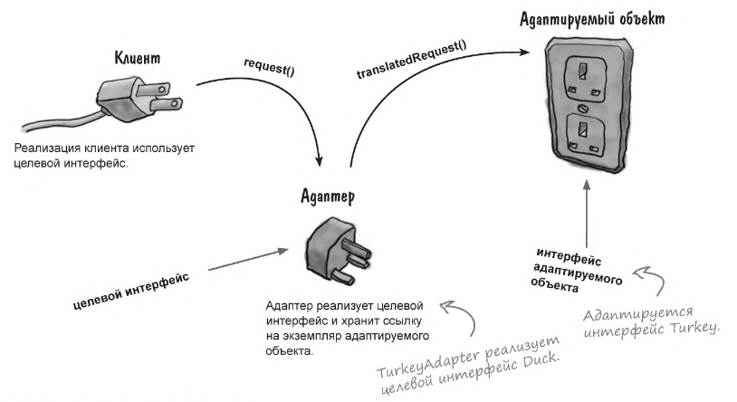
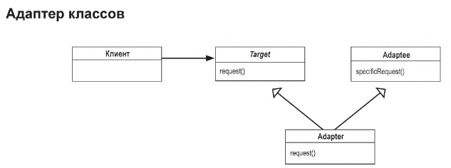

## 🔋 Паттерн Адаптер
В этой главе будем имитировать интерфейс, которым
они в действительности не обладают. Для чего?  
Чтобы адаптировать архитектуру, рассчитанную на один
интерфейс, для класса, реализующего другой интерфейс.

### Содержание
1. [Адаптеры вокруг нас](#-адаптеры-вокруг-нас)
2. [Объектно-ориентированные адаптеры](#-объектно-ориентированные-адаптеры)
3. [Разновидности адаптеров](#-разновидности-адаптеров)
4. [Практическое применение адаптеров](#-практическое-применение-адаптеров)
5. [Ответы на вопросы](#-ответы-на-вопросы)

### 🔌 Адаптеры вокруг нас
Адаптер включается между вилкой ноутбука и розеткой
европейского стандарта, он адаптирует европейскую розетку,
чтобы вы могли подключить к ней свое устройство и пользоваться им.
Или можно сказать иначе: адаптер приводит интерфейс розетки
к интерфейсу, на который рассчитан ваш ноутбук.

> Адаптеры преобразуют интерфейс к тому виду,
> на который рассчитан клиент.

### 📲 Объектно-ориентированные адаптеры
Адаптер играет роль посредника: он получает запросы от
клиента и преобразует их в запросы, понятные внешним классам.


**Как клиент работает с адаптером:**
1) Клиент обращается с запросом к адаптеру, вызывая
его метод через целевой интерфейс.
2) Адаптер преобразует запрос в один или несколько
вызовов адаптируемому объекту (в интерфейсе последнего).
3) Клиент получает результаты вызова, даже не подозревая
о преобразованиях, выполненных адаптером.



> Итак, чтобы использовать клиент с несовместимым интерфейсом,
> мы создаем адаптер, который выполняет преобразование.

### ✍️ Разновидности адаптеров
На самом деле существует две разновидности адаптеров:
_**адаптеры объектов**_ и _**адаптеры классов**_.

Что же такое **_адаптер классов_** и почему мы о них ничего не рассказываем?
Потому что для их реализации необходимо **множественное наследование,
запрещенное в языке Java.**

Ниже будет представлена UML-диаграмма для паттерна **_Адаптер классов_**:



### ⌨️ Практическое применение адаптеров
Опытные Java-программисты помнят, что ранние реализации
коллекций (`Vector`, `Stack`, `Hashtable` и некоторые другие)
реализовали метод `elements()`, который 
возвращал **перечислитель (Enumeration)**.

```java
import java.util.Enumeration;

boolean hasMoreElements();  // Проверяет, остались ли элементы в коллекции
E nextElement();            // Возвращает следующий элемент в коллекции
```

В обновленных классах коллекций используется более современный
интерфейс итераторов. Как и перечисления, итераторы позволяют
перебирать элементы коллекций, но также обладают возможностью
удаления элементов.

```java
import java.util.Iterator;

boolean hasNext();      // Аналог метода hasMoreElements()
E next();               // Возвращает следующий элемент в коллекции
void remove();          // Удаляет элемент из коллекции
```

> Классический паттерн "Адаптер" сам по себе не предназначен
> для добавления новых функций вроде защиты от перенапряжения или индикации.
> Его задача – только согласовывать интерфейсы.  
> Для расширения функционала с сохранением совместимости подойдет комбинация
> паттернов.  
> Так, например, именно паттерн "Декоратор" позволит решить эту
> задачу – он динамически добавляет новые обязанности объекту, не
> меняя его интерфейс.

### ✅ Ответы на вопросы
1) Сложность реализации адаптера пропорциональна
размеру целевого интерфейса. Конечно, можно
переработать все клиентские вызовы к интерфейсу, но это
потребует огромной работы по анализу и изменению кода.
А можно предоставить всего один класс, который инкапсулирует
все изменения.
2) Задача паттерна Адаптер – преобразовать один интерфейс к другому
интерфейсу. Хотя в большинстве примеров используется один
адаптируемый объект, на практике адаптеру иногда приходится
хранить два и более объекта, необходимых для реализации
целевого интерфейса.
> Паттерн Адаптер часто путают с паттерном Фасад.
3) Всегда можно создать Двойной адаптер, если необходимо
реализовать несколько интерфейсов. Например, для старых и новых компонентов.
Адаптер можно будет использовать в обеих ролях.

