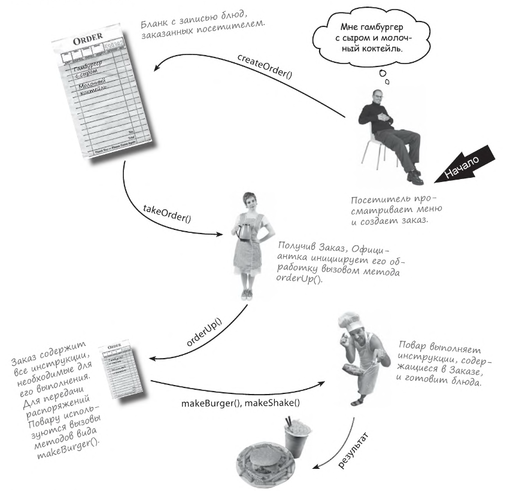

## 🏐 Паттерн Команда
Вызывающему объекту не нужно беспокоиться о том,
как будут выполняться его запросы. Он просто использует
инкапсулированный метод для решения своей задачи.
Инкапсуляция позволяет решать и такие нетривиальные задачи,
как регистрация или повторное использование для реализации
функции отмены в коде.

## 📝 Содержание
1. [Описание паттерна](#-описание-паттерна-команда)

### 🏷️ Описание паттерна Команда
Для понятия этого паттерна следует обратиться к аналогии,
связанной с рестораном.
Итак, будем рассматривать **бланк Заказа как объект запроса
на приготовление еды.**  
Как и любой другой объект, он может передаваться – от Официантки
на стойку или следующей Официантке, которая сменяет первую.

Задача Официантки – получить Заказ и вызвать его метод `orderUp()`.
Официантка не беспокоиться о том, что содержится в Заказе и кто 
его будет выполнять. Ей лишь известно то, что у Заказа есть
метод `orderUp()`, который необходимо вызвать для выполнения операции.

Повар – это тот объект, который умеет выполнять заказы. После того
как Официантка вызовет метод `orderUp()`, за дело
берется Повар – он реализует все методы, необходимые для
создания блюд. Обратите внимание: Официантка и Повар ничем не связаны.
Вся информация о блюдах находится в Заказе; Официантка
только вызывает метод для каждого Заказа, чтобы он был выполнен.
Повар получает свои инструкции из бланка Заказа; ему никогда
не приходится взаимодействовать с Официанткой напрямую.

