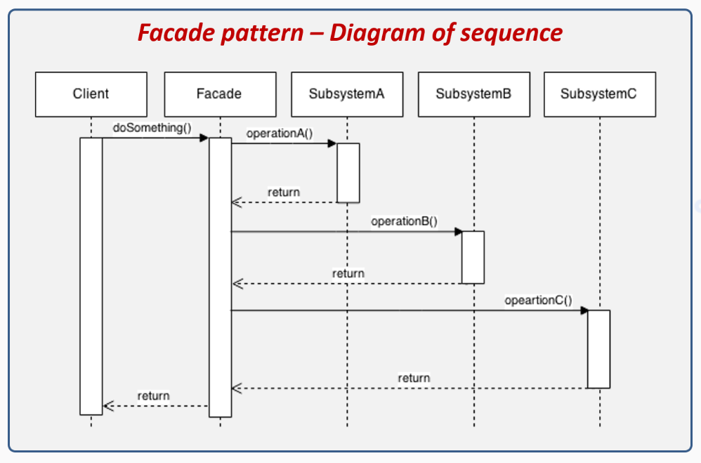

## 🏛️ Паттерн Фасад
Паттерн Фасад изменяет интерфейс, но по другой причине: для его упрощения.
Паттерн скрывает все сложности внутреннего строения одного или нескольких
классов за лаконичным, четко определенным фасадом.



### 📑 Содержание
1. [Построение домашнего кинотеатра](#-построение-домашнего-кинотеатра)
2. 

### 🎞️ Построение домашнего кинотеатра
Прежде чем погружаться в подробности строения паттерна Фасад,
следует обратиться к модному нынче увлечению: построению домашнего
кинотеатра для просмотра фильмов и сериалов.

**_Просмотр фильма будет включать в себя следующие действия:_**
1. Включить аппарат для попкорна.
2. Запустить приготовление попкорна.
3. Выключить свет.
4. Опустить экран.
5. Включить проектор.
6. Выбрать на проекторе вход медиаплеера.
7. Включить полноэкранный режим на проекторе.
8. Включить усилитель.
9. Выбрать на усилителе вход медиаплеера.
10. Включить на усилителе режим объемного звука.
11. Установить на усилителе среднюю громкость (5).
12. Включить медиаплеер.
13. Запустить фильм на воспроизведение.

```java
// Включить аппарат для попкорна, начать готовить попкорн
popper.on();
popper.pop();

// Уменьшить яркость света
lights.dim(10);

screen.down();

// Включить проектор и выбрать широкоэкранный режим для кино
projector.on();
projector.setInput(player);
projector.wideScreenMode();

// Включить усилитель, выбрать на нем медиаплеер
amp.on();
amp.setStreamingPlayer(player);
amp.setSurroundSound();
amp.setVolume(5);

// Включить медиаплеер и запустить фильм
player.on();
player.play(movie);
```

Уже устали, не так ли?! А ведь всего-то включили всю аппаратуру!

Фасад – именно то, что нам нужно: мы берем сложную подсистему
и для упрощения работы с ней реализуем фасадный класс, который
предоставляет общий, более удобный интерфейс.

**_Паттерн Фасад (Facade) предоставляет упрощенный интерфейс,
оставляя доступ к полной функциональности подсистемы._**

> Фасад не только упрощает интерфейс, но и обеспечивает
> логическую изоляцию клиента от подсистемы, состоящей
> из многих компонентов.
> 
> Фасад применяется для упрощения, а адаптер – для преобразования
> интерфейса к другой форме.