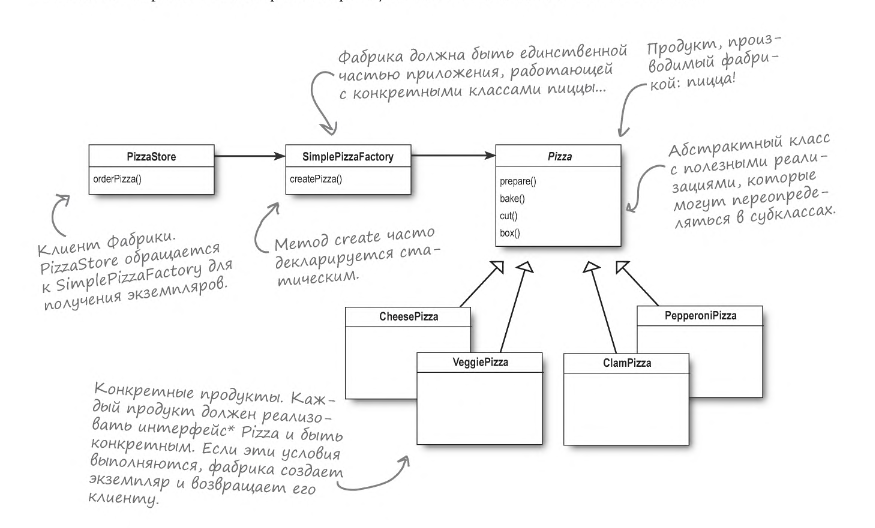
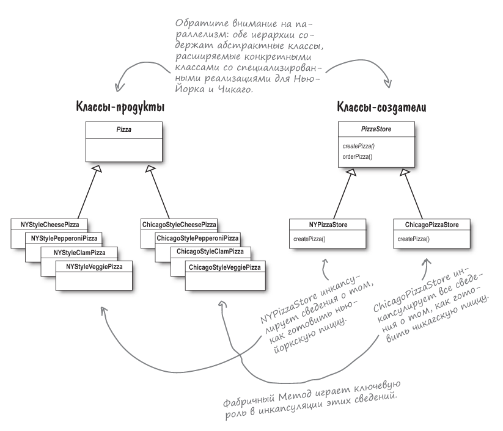
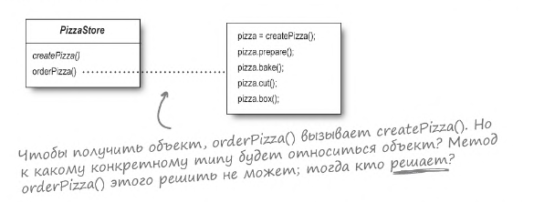
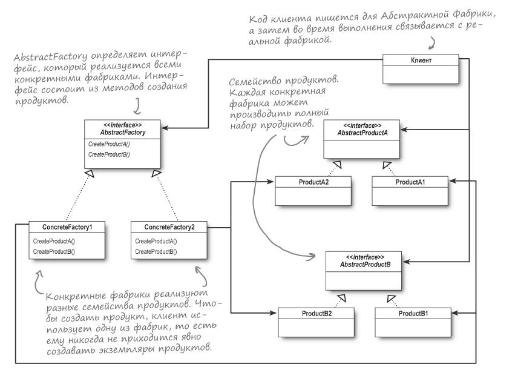

## 🏠 Содержание
1. [Фабрика](#-паттерн-фабрика)
2. [Определение Простой Фабрики](#-определение-простой-фабрики)
3. [Способ реализации](#-еще-один-способ-реализации)
4. [Фабричный метод](#-фабричный-метод)
5. [Принцип инверсии зависимостей](#принцип-инверсии-зависимостей)

## 🏭 Паттерн Фабрика
Создание объектов отнюдь не сводится к
простому вызову оператора `new`, ибо оно часто
создает проблемы сильного связывания, чего мы, разумеется, не хотим.

При использовании ключевого слова `new` создается экземпляр
конкретного класса, поэтому эта операция относится к уровню
реализации, а не интерфейса.
Привязка к конкретному классу делает код менее гибким
и устойчивым к изменениям.

Если в Вашей архитектуре приложения используется набор взаимосвязанных
конкретных классов, то в конечном итоге код будет выглядеть примерно так:

```java
Duck duck;

if (picnic) {
    duck = new MallardDuck();
} else if (hunting) {
    duck = new ModelDuck();    
} else if (inBathTub) {
    duck = new RubberDuck();    
}
```
Это плохо, поскольку когда настанет время изменения
или расширения, Вам придется снова открыть код и разобраться
в том, что нужно добавить (или удалить). Часто подобный код размещается
в разных частях приложения, что основательно затрудняет его сопровождение
и обновление.

Итак, следует выделить представленный выше код в объект,
который занимается только созданием уток и ничем более.
Если другому объекту понадобится создать экземпляр утки,
то он обратится к нему с запросом.

**У нового объекта имеется подходящее имя: Фабрика.**  
Фабрика инкапсулирует подробности создания объектов.  
Пример:
```java
public class SimplePizzaFactory {

    public Pizza createPizza(String type) {
        Pizza pizza = null;

        if (type.equals("cheese")) {
            pizza = new CheesePizza();
        } else if (type.equals("pepperoni")) {
            pizza = new PepperoniPizza();
        } else if (type.equals("clam")) {
            pizza = new ClamPizza();
        } else {
            throw new IllegalArgumentException("Invalid pizza type");
        }
        
        return pizza;
    }
}
```

### 🚨 Определение Простой Фабрики
Строго говоря, Простая Фабрика не является паттерном проектирования,
скорее это идиома программирования.

Хотя Простая Фабрика не является ПОЛНОЦЕННЫМ паттерном, это не
значит, что ее не стоит изучить более подробно. Ниже представлена диаграмма
классов:



> В паттернах проектирования фраза **"реализация интерфейса"**
> **НЕ ВСЕГДА** обозначает __"класс, реализующий интерфейс с ключевым 
> словом implements в объявлении."__ _В более общем смысле
> реализация конкретным классом метода супертипа (класса ИЛИ интерфейса)
> считается_ **_"реализацией интерфейса"_** _этого супертипа_.

### 📌 Еще один способ реализации
Заменим `SimplePizzaFactory` тремя разными фабриками:
`NYPizzaFactory`, `ChicagoPizzaFactory`, `CaliforniaPizzaFactory`.

Код будет выглядеть примерно так:

```java
import factory.simpleFactory.store.PizzaStore;

NYPizzaFactory nyFactory = new NYPizzaFactory();
PizzaStore nyStore = new PizzaStore(nyFactory);
nyStore.orderPizza("Veggie");

ChicagoPizzaFactory chicagoFactory = new ChicagoPizzaFactory();
PizzaStore chicagoStore = new PizzaStore(chicagoFactory);
chicagoStore.orderPizza("Veggie");
```

### 👾 Фабричный метод
Все фабричные паттерны инкапсулируют операции создания объектов.
**Паттерн Фабричный метод** позволяет субклассам решить, какой объект
следует создать.



Часто создатель содержит код, зависящий от абстрактного
продукта, производимого субклассом. Создатель никогда
не знает, какой конкретный продукт будет произведен.

> Классы, создающие продукты, называются конкретными создателями.



Когда `orderPizza()` вызывает `createPizza()`, управление
передается одному из субклассов. Какая именно из конкретных
разновидностей пиццы будет создана? Это зависит от типа
пиццерии: `NYStylePizzaStore` или `ChicagoStylePizzaStore`.

### ♨️ Принцип инверсии зависимостей
Сокращение зависимостей от конкретных классов - явление
положительное. Более того, этот факт закреплен в одном
из принципов ОО-проектирования с красивым впечатляющим
названием `принцип инверсии зависимостей`.

Этот принцип формулируется так:
> Код должен зависеть от абстракций, а не от конкретных
> классов.

_**Принцип требует, чтобы высокоуровневые компоненты
не зависели от низкоуровневых компонентов; вместо этого
и те и другие должны зависеть от абстракций.**_

Несколько советов по применению принципа инверсии зависимостей:
1) Ссылки на конкретные классы не должны храниться в
переменных. При использовании `new` сохраняется ссылка на конкретный класс.
2) В архитектуре не должно быть классов, производных
от конкретных классов. Наследование от конкретного класса
создает зависимость от него. Определяйте классы производными
от абстракций - интерфейсов или абстрактных классов.
3) Ни один метод не должен переопределять реализованный метод
любого из его базовых классов. Методы, реализованные в базовом
классе, должны использоваться всеми субклассами.

### 🏬 Абстрактная Фабрика
Абстрактная Фабрика определяет интерфейс создания семейства
продуктов. Использование этого интерфейса отделяет код
от фабрики, создающей продукты.  
Таким образом создаются разнообразные фабрики, производящие
продукты для разных контекстов: разных регионов, операционных систем
или вариантов оформления.

> Паттерн Абстрактная Фабрика предоставляет интерфейс
> создания семейств взаимосвязанных или взаимозависимых объектов
> без указания их конкретных классов.

Таким образом, клиент отделяется от подробностей конкретного продукта.
Следующая диаграмма классов показывает, как это работает:



**Примечание:**
> Методы Абстрактной Фабрики часто реализуются как фабричные методы.
> Задача Абстрактной Фабрики - определить интерфейс для набора продуктов. Таким образом, фабричные методы являются естественным
> способом реализации методов продуктов в абстрактных фабриках.

**_Ключевые моменты:_**
1) Все фабрики инкапсулируют создание объектов.
2) Фабричный Метод основан на наследовании: создание объектов
делегируется субклассам, реализующим Фабричный Метод для создания объектов.
3) Абстрактная Фабрика основана на композиции: создание объектов
реализуется в методе, доступ к которому осуществляется через интерфейс фабрики.
4) Все фабричные паттерны обеспечивают слабую связанность за счет
сокращения зависимости приложения от конкретных классов.
5) Задача Фабричного Метода – перемещение создания экземпляров в субклассы.
6) Задача Абстрактной Фабрики – создание семейств взаимосвязанных
объектов без зависимости от их конкретных классов.