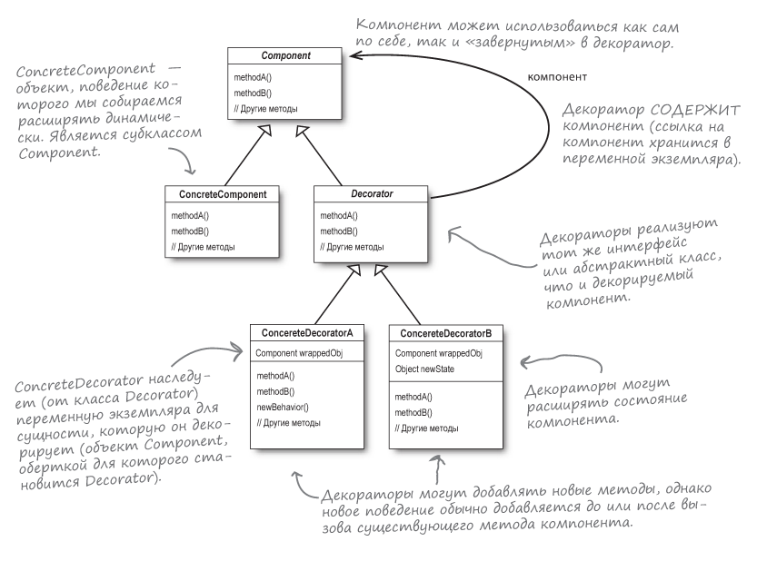
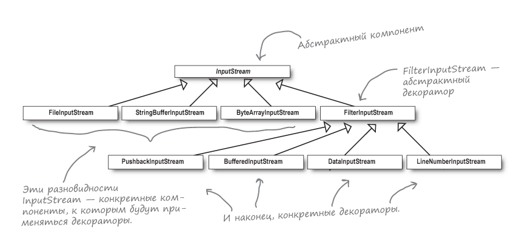

## 🎉 Украшение объектов (паттерн Декоратор)
В этой главе рассказывается, как декорировать
свои классы во время выполнения с использованием разновидности
композиции. Этот подход позволяет наделить свои (или) чужие
объекты новыми возможностями без модификации кода классов.

### 💯 Заметки
> Динамическая композиция объектов позволяет
> добавлять новую функциональность посредством написания
> нового кода (вместо изменения существующего).
> Так как мы не изменяем готовый код, риск введения
> ошибок или непредвиденных побочных эффектов значительно
> снижается.

### ☕ Пример работы паттерна Декоратор

> **Паттерн Декоратор** динамически наделяет объекты новыми
> возможностями и является гибкой альтернативой субклассированию
> в области расширения функциональности.

Итак, схема вычисления стоимости напитка с дополнениями
посредством наследования обладает рядом недостатков:
это и разрастание классов, и негибкая архитектура,
и присутствие в базовом классе функциональности,
неуместной в некоторых субклассах.

Поэтому мы поступаем иначе: начинаем с базового напитка
и "декорируем" его на стадии выполнения.

**Алгоритм:**
1) Начинаем с объекта `DarkRoast` (кофе темной обжарки).
2) Декорируем его объектом `Mocha` (шоколад).
3) Декорируем его объектом `Whip` (взбитые сливки).
4) Вызываем метод `cost()` и пользуемся делегированием
для прибавления стоимости дополнений.

### 📊 Диаграмма классов

UML-диаграмма:

> 1. Декораторы имеют тот же супертип, что и декорируемые объекты.
> 2. Объект можно завернуть в один или несколько декораторов.
> 3. Так как декоратор относится к тому же супертипу, что и декорируемый
> объект, мы можем передать декорированный объект вместо исходного.
> 4. **_Декоратор добавляет свое поведение до и (или) после делегирования
> операций декорируемому объекту, выполняющему остальную работу._**
> 5. Объект может быть декорирован в любой момент времени,
> так что мы можем декорировать объекты динамически и с произвольным
> количеством декораторов.

### 👑 Декорирование классов в java.io

Пакет java.io в языке Java использует паттерн Декоратор.  
`ZipInputStream` -> `BufferedInputStream` -> `FileInputStream`.  
FileInputStream - декорируемый компонент. Библиотека ввода/вывода
Java предоставляет **базовые компоненты FileInputStream,
StringBufferInputStream, ByteArrayInputStream**.
