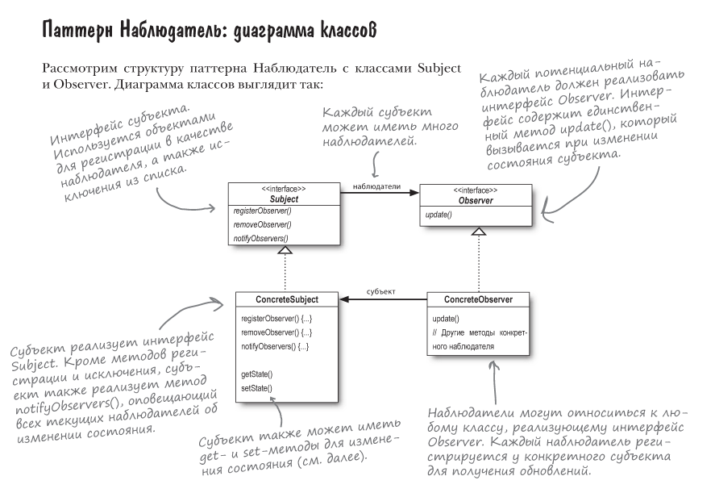

## ❇️ Приложение Weather Monitoring
Система состоит из 3-х элементов:
метеостанция (физическое устройство, занимающееся
сбором данных), объект WeatherData (отслеживает данные,
поступающие от метеостанции, и обновляет отображаемую
информацию), и экрана, на котором выводится текущая
информация о погоде.

Схема:
```text
Метеостанция -> Объект Weather Data -> Визуальный элемент.
```
Необходимо адаптировать объект `WeatherData`, чтобы
он умел обновлять выводимые данные.

> Задача - создать приложение, которое использует
данные объекта `WeatherData` для обновления
текущих условий, статистики и прогноза погоды.

Помимо этого, не стоит забывать про расширяемость системы.
> В настоящее время нам известны три исходных типа
> экранов _(сводка, статистика и прогноз)_, но в
> будущем ожидается процветающий рывок для новых
> экранов, поэтому **_почему бы не разрешить пользователям
> добавлять (или удалять) столько экранных элементов,
> сколько им захочется?!_**

**Издатели + Подписчики = Паттерн Наблюдатель.**

Если вы понимаете, как работает газетная подписка,
то вы в значительной мере понимаете и **паттерн
Наблюдатель**, только в данном случае _**издатель называется
СУБЪЕКТОМ**_, а **_подписчики - НАБЛЮДАТЕЛЯМИ_**.

**Важно!**
> Наблюдатели регистрируются у субъекта, чтобы
> получить оповещения при изменении.

**Определение паттерна "Наблюдатель":**
> _**Паттерн Наблюдатель**_ определяет отношение
> "один ко многим" между объектами таким образом,
> что при изменении состояния одного объекта
> происходит автоматическое оповещение и обновление
> всех зависимых объектов.

> **_Когда состояние одного объекта изменяется,
все зависимые объекты получают оповещения._**

Наглядное объяснение паттерна:



В **паттерне Наблюдатель** субъект обладает состоянием
и управляет им. Таким образом, существует ОДИН
субъект, обладающий состоянием. С другой стороны,
наблюдатели используют состояние, хотя и не обладают им.
Они зависят от субъекта, который оповещает их
об изменении состояния. Возникает отношение, в котором
участвует ОДИН субъект и МНОГО наблюдателей.

**_Диаграмма классов:_**


Архитектуры со слабыми связями часто обладают
большой гибкостью. 
Паттерн Наблюдатель является
отличным примером слабого связывания. 

За счет чего достигается слабое связывание?
1) **Единственное, что знает субъект о наблюдателе, – то,
что тот реализует некоторый интерфейс (Observer).**
Ему не нужно знать ни конкретный класс наблюдателя,
ни его функциональность... ничего.
2) **Новые наблюдатели могут добавляться в любой момент.**
Любого наблюдателя во время выполнения можно
заменить другим наблюдателем или исключить его из
списка – субъект этого не заметит.
3) **Добавление новых типов наблюдателей не требует
модификации субъекта.**
4) **Субъекты и наблюдатели могут повторно использоваться
независимо друг от друга.** Между ними не существует
сильных связей, что позволяет повторно использовать их
для других целей.
5) **Изменения в субъекте или наблюдателе не влияют
на другую сторону.**

**Принцип проектирования:**
> Стремитесь к слабой связанности взаимодействующих
> объектов.

#### 🔫 Паттерн Наблюдатель в естественной среде
Если взглянуть на код JDK (Java Development Kit),
паттерн Наблюдатель используется в **библиотеках Swing**
**и JavaBeans**.
Помимо этого, паттерн Наблюдатель используется в
событиях JavaScript, в Cocoa, в протоколе отслеживания
ключей/значений Swift... и это далеко не полный список.

> Если Вас интересует поддержка **паттерна Наблюдатель**
> в JavaBeans, стоит присмотреться к 
> интерфейсу `PropertyChangeListener`.

Когда-то язык Java предоставлял **класс** `Observable`
и **интерфейс** `Observer`, которые можно было использовать для
интеграции паттерна Наблюдатель в код пользователя.
**Класс Observable** предоставлял методы для добавления,
удаления и уведомления наблюдателей, чтобы разработчику
не приходилось писать этот код самостоятельно. А **_интерфейс Observer
предоставлял один единственный метод update()._**

Начиная с Java 9, эти классы считаются устаревшими,
поэтому **Observable/Observer** уходят в небытие.

Реализация программы WeatherStation при помощи `java.util.Observable`
и `java.util.Observer` находится в этом [пакете](weatherobservable).
